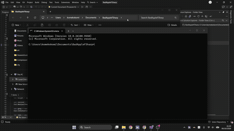

# Bad Apple!!

Plays Bad Apple!! as ASCII art directly in the terminal using F#, with synchronized MP3/MIDI audio.

## Requirements

- [.NET 10 SDK](https://dotnet.microsoft.com/)
- Windows (uses WPF native + ANSI console)
- Source files in the `source/` folder:
  - `BadApple.mp4`
  - `bad-apple-audio.mp3`
  - `alstroemeria_records_bad_apple.mid`

## Build & Run

```bash
# Build
dotnet build

# Publish (self-contained)
dotnet publish -c Release -r win-x64 --self-contained

# Run
dotnet run
```

## Usage

```
==============================================================
  Bad Apple!!
==============================================================
  1) Play  (MP3 audio)
  2) Play  (MIDI audio — starts 30 frames in for sync)
  3) Set frame width (default: 150)
  4) Exit
==============================================================
```

- **Option 1/2**: Converts the video to ASCII then plays it (generated once and cached for subsequent plays).
- **Option 3**: Adjusts the ASCII width — the wider, the larger the terminal needs to be.

## Dependencies

| Library | Purpose |
|---------|---------|
| [OpenCvSharp4](https://github.com/shimat/opencvsharp) | Read & process video frames |
| [NAudio](https://github.com/naudio/NAudio) | MP3 audio playback |

## Demo



> 🎬 [Watch Full Video (MP4)](https://syudou.ayanomi.io.vn/media/badaple.mp4)
